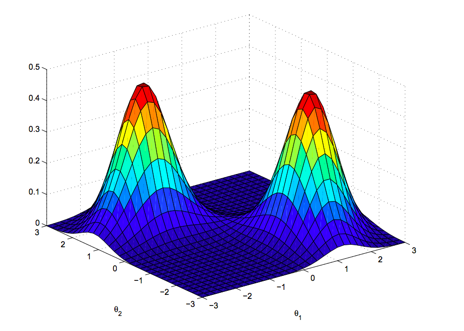

# SePRo: Separation Process with R

Estimating of parameters in statistical distributions. 
Package provides an implementation of the EM algorithm (Expectation Maximization Algorithm) in the R language. Today, EM and its variants are regularly used to solve a broad range of today’s estimation problems, from the multiple EM for motif elicitation (MEME) algorithm for motif-finding in DNA squences, to fitting mixture models to disambiguate targets from clutter in radar. Hope that you, too, will find EM useful.

<figure>

<figcaption aria-hidden="true"><em>Example of mixture - 2 Gaussian
functions</em></figcaption>
</figure>

## Installation in R

**sepro** is a GitHub package so you can use ‘install_github()‘ from
[devtools][] package.  Install **devtools** first:

    if("devtools" %in% rownames(installed.packages()) == FALSE){
    install.packages("devtools")
    }
    library(devtools)

 After that you can install **sepro** package:

    install_github("hdrbv/sepro", ref = "main")
    library(sepro)

  [devtools]: https://cran.r-project.org/web/packages/devtools/index.html
