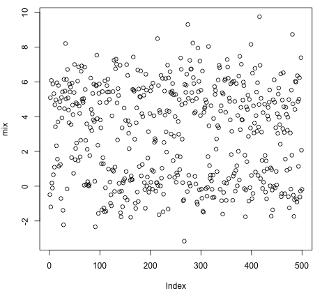

# SePRo: Separation Process with R

Estimating of parameters in statistical distributions using R. Package
provides an implementation of the EM algorithm (Expectation Maximization
Algorithm) in the R language. Today, EM and its variants are regularly
used to solve a broad range of today’s estimation problems, from the
multiple EM for motif elicitation (MEME) algorithm for motif-finding in
DNA sequences, to fitting mixture models to disambiguate targets from
clutter in radar. Hope that you, too, will find EM useful. You can see
details of usage
[here](https://github.com/hdrbv/sepro/blob/main/Tutorial/sepro-details.pdf/).

## Installation in R

**sepro** is a GitHub package so you can use ‘install\_github()‘ from
[devtools](https://cran.r-project.org/web/packages/devtools/index.html)
package.  Install **devtools** first:

    if("devtools" %in% rownames(installed.packages()) == FALSE){
    install.packages("devtools")
    }
    library(devtools)

 After that you can install **sepro** package:

    install_github("hdrbv/sepro", ref = "main")
    library(sepro)

## Theory

Let’s assume that we have some observed data
\\(y\\), a parametric density
\\(p(y|\\theta)\\), a description of
some complete data \\(x\\) that we wish
we had, and the parametric density
\\(p(x|\\theta)\\). We assume that the
complete data can be modeled as a continuous random vector
\\(X\\) with density
\\(p(x|\\theta)\\), where
\\(\\theta \\in \\Omega\\) for some set
\\(\\Omega\\). We do not observe
\\(X\\) directly, instead we observe a
realization \\(y\\) of the random
vector \\(Y\\) that depends on
\\(X\\). For example,
\\(Y\\) might be the first component of
the vector \\(X\\).

Given that we only have \\(y\\), the
main goal here is to find the maximum likelihood estimate (MLE) of
\\(\\theta\\):

\\\[\\hat{\\theta}\_{MLE} = argmax\\
p(y|\\theta)\\\]

Is’s often easier to calculate the
\\(\\theta\\) that maximizes the
log-likelihood of \\(y\\):

\\\[\\hat{\\theta}\_{MLE} = argmax\\ log\\
p(y|\\theta)\\\]

Because \\(log()\\) is a monotonically
increasing function, solutions will be the same for both equations. But
sometimes it’s difficult to solve them. Then we can try EM: we make a
guess about the complete data \\(X\\)
and solve for the \\(\\theta\\) that
maximizes the (expected) log-likelihood of X. And once we have an
estimate for \\(\\theta\\), we can make
a better guess about the complete data
\\(X\\), and iterate.

Let’s break E-step and M-step of algorithm down into five steps:

1.  Let \\(m = 0\\) and make initial
    estimate \\(\\theta^{(m)}\\) for
    \\(\\theta\\)

2.  Given the observed data \\(y\\) and
    pretending for the moment that your current guess
    \\(\\theta^{(m)}\\) is correct,
    formulate the conditional probability distribution
    \\(p(x|y, \\theta^{(m)}\\) for the
    complete data \\(x\\)

3.  Using the conditional probability distribution
    \\(p(x|y, \\theta^{(m)})\\)
    calculated in step 2, form the conditional expected log-likelihood,
    which is called the Q-function:
    
    \\\[Q(\\theta | \\theta^{m}) = \\int
    logp(x|\\theta)p(x|y, \\theta^{m})dx =\\\]
    \\\[= E\_{X|y,
    \\theta^{m}}(logp(X|\\theta))\\\]
    
    where the integral is over set
    \\(\\chi(y)\\), which is the
    closure of the set \\({x|p(x|y, \\theta)\>
    0}\\), and assume that
    \\(\\chi(y)\\) does not depend on
    \\(\\theta\\).

4.  Find the \\(\\theta\\) that
    maximizes \\(Q\\) - function;
    result = our new estimate =
    \\(\\theta^{(m+1)}\\)

5.  Let m = m + 1 and go back to Step №2. EM algorithm does not specify
    a stopping criterion; standard criteria are to iterate until the
    estimate stops changing:
    \\(|\\theta^{(m+1)} - \\theta^{(m)}| \<
    \\epsilon\\) for some
    \\(\\epsilon\\) \> 0, or to iterate
    until the log-likelihood
    \\(l(\\theta^{m+1}) - l(\\theta^{m}) \<
    \\epsilon\\) for some
    \\(\\epsilon\\) \> 0

EM algorithm is only guaranteed to never get worse. Usually, it will
find a peak in the likelihood
\\(p(y|\\theta)\\), but if the
likelihood function \\(p(y|\\theta)\\)
has multiple peaks, EM will not necessarily find the global maximum of
the likelihood. In practise, it’s common to start EM from multiple
random initial guesses, and choose the one with the largest likelihood
as the final guess for \\(\\theta\\)

## Practice

Let’s apply theory to practise and also check the work of
[sepro](https://github.com/hdrbv/sepro) package. Firstly, let’s create
mixture of two distributions which we will separate:

    set.seed(1) #fix results of randomization
    cond <- sample(c(0, 1), size = 500, 
    replace = TRUE, prob = c(0.4, 0.6))
    # Sample from two different Gaussian distributions
    mix <- ifelse(cond == 1, rnorm(n = 500, mean = 5, sd = 1.5), 
    rnorm(n = 500, mean = 0, sd = 1))
    plot(mix)

Apply \\(EM\\) function from
[sepro](https://github.com/hdrbv/sepro) package to our mixture:

    vect <- as.numeric(mix)
    EM1 <- EM(vect, 2)

And use \\(plot\\\_em\\) function from
package to see results of separation process:

    plot_em(vect, EM1)

That’s it. We have a fairly accurate parameter estimation of our
distributions - it’s really close to
real:

| :----------------------------------------------: | :--------------------------------------: | :----------------------------------------: |
|                    \[-1.8ex\]                    |              Expected value              |                  Variance                  |
|                                                  |                                          |                                            |
| \[-1.8ex\] Distribution 1 (from initial dataset) | \\(0\\) |  \\(1\\)  |
|      Distribution 2 (from initial dataset)       | \\(5\\) | \\(1.5\\) |
|    Distribution 1 (after separation process)     | \\(0\\) |  \\(1\\)  |
|    Distribution 2 (after separation process)     | \\(5\\) |  \\(2\\)  |

